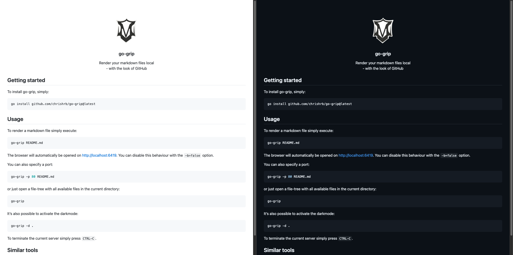

<!-- PROJECT LOGO -->
<br />
<div align="center">
  <a href="#">
    
  </a>

  <h3 align="center">go-grip</h3>

  <p align="center">
    Render your markdown files local<br>- with the look of GitHub
  </p>
</div>

## 🚀 Getting started

To install go-grip, simply:

```bash
go install github.com/chrishrb/go-grip@latest
```

## 🔨 Usage

To render the `README.md` file simply execute:

```bash
go-grip README.md
# or
go-grip
```

The browser will automatically open on http://localhost:6419. You can disable this behaviour with the `-b=false` option.

You can also specify a port:

```bash
go-grip -p 80 README.md
```

or just open a file-tree with all available files in the current directory:

```bash
go-grip -r=false
```

It's also possible to activate the darkmode:

```bash
go-grip -d .
```

To terminate the current server simply press `CTRL-C`.

## 📝 Examples



## 📌 Similar tools

This tool is, like the name already says, a reimplementation of [grip](https://github.com/joeyespo/grip) in go and without using the web API of GitHub.
