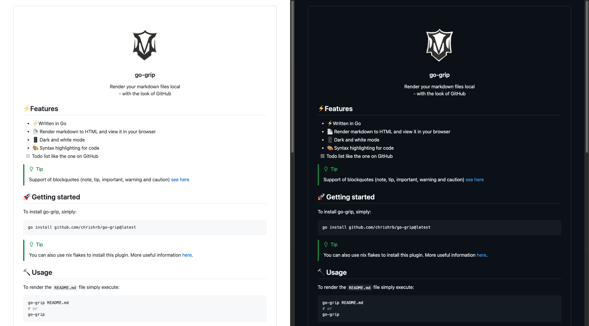

<!-- PROJECT LOGO -->
<br />
<div align="center">
  <a href="#">
    
  </a>

  <h3 align="center">go-grip</h3>

  <p align="center">
    Render your markdown files local<br> (github flavored rendering)
  </p>
</div>

## :question: About

**go-grip** is a lightweight, Go-based tool designed to render Markdown files locally, replicating GitHub's style. It offers features like syntax highlighting, dark mode, and support for mermaid diagrams, providing a seamless and visually consistent way to preview Markdown files in your browser.

This project is a reimplementation of the original Python-based [grip](https://github.com/joeyespo/grip), which uses GitHub's web API for rendering. By eliminating the reliance on external APIs, go-grip delivers similar functionality while being fully self-contained, faster, and more secure - perfect for offline use or privacy-conscious users.

## :zap: Features

- :zap: Written in Go :+1:
- 📄 Render markdown to HTML and view it in your browser
- 📱 Dark and light theme
- 🎨 Syntax highlighting for code
- [x] Todo list like the one on GitHub
- Support for github markdown emojis :+1: :bowtie:
- Support for mermaid diagrams


> [!TIP]
> Support of blockquotes (note, tip, important, warning and caution) [see here](https://github.com/orgs/community/discussions/16925)

> [!IMPORTANT]
>
> test

## :rocket: Getting started

To install go-grip, simply:

```bash
go install github.com/chrishrb/go-grip@latest
```

> [!TIP]
> You can also use nix flakes to install this plugin.
> More useful information [here](https://nixos.wiki/wiki/Flakes).

## :hammer: Commands and Usage

### Basic Usage

```bash

go-grip [COMMAND] <args>

# go-grip --help
Available commands:
  go-grip render FILE   - Generate static HTML from markdown
  go-grip serve FILE    - Serve markdown via local HTTP server

Available Commands:
  completion   Generate the autocompletion script for the specified shell
  emojiscraper Scrape emojis from gist
  help         Help about any command
  render       Render markdown document as html
  serve        Run as a server and serve the markdown file
  version      Print the version number of go-grip

Flags:
  -h, --help   help for go-grip

Use "go-grip [command] --help" for more information about a command.

```

### Commands

#### `render` - Generate static HTML Files

Render a markdown file as static HTML.

```
Usage:
  go-grip render [file|directory] [flags]

Optional Flags:
      --bounding-box    Add bounding box to HTML output (default true)
  -d, --directory       Render all markdown files in directory
  -h, --help            help for render
  -o, --output string   Output directory for static files
      --theme string    Select CSS theme [light/dark/auto] (default "auto")

```

Examples:

```bash
# render a single markdown file (opens it in a new browser tab)
go-grip render README.md

# specify custom output directory
go-grip render README.md -o /path/to/output

# render ALL markdown files in a directory
go-grip render -d /path/to/my-note/ --output ./html-notes/
```

### `serve` - Live Preview Server

Start a local server to render and serve the markdown file.

The server will watch for changes to the file and automatically refresh the browser.
This is useful for live previewing markdown as you edit it.

```
Usage:
  go-grip serve FILE [flags]

Flags:
      --bounding-box   Add bounding box to HTML output (default true)
  -b, --browser        Open browser tab automatically (default true)
  -h, --help           help for serve
  -H, --host string    Host to listen on (default "localhost")
  -p, --port int       Port to listen on (default 6419)
      --theme string   Select CSS theme [light/dark/auto] (default "auto")
```

Examples:

```bash
# Start server for live preview of a file
go-grip serve README.md

# Specify host and port
go-grip serve README.md -H 0.0.0.0 -p 8080

# Disable automatic browser opening
go-grip serve README.md -b=false
```

#### `-d/--directory` flag

When passed after the the `render` command, go-grip will:

1. Generate HTML for all markdown files in the directory
2. Create an index page linking to all rendered files
3. Copy all required static assets (CSS, JS, images)

## :pencil: Screen shots



## :bug: TODOs

- [ ] Tests and refactoring
- [ ] Move `theme` selection feature from CLI to a button in rendered HTML
- [ ] Auto `Table of content` generation
- [ ] Purged static files (Opens the door for Single HTML output)
- [ ] Github flavored `blob` support
- [ ] Output to Image

## :pushpin: Similar tools

This tool is a Go-based reimplementation of the original [grip](https://github.com/joeyespo/grip), offering the same functionality without relying on GitHub's web API.
