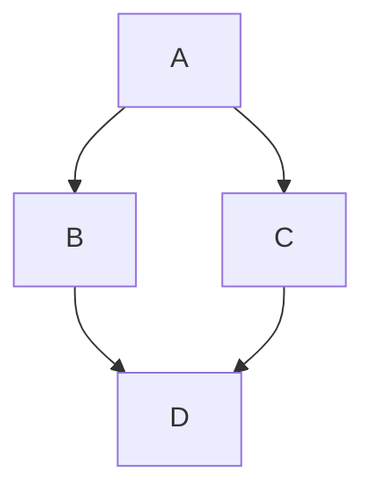
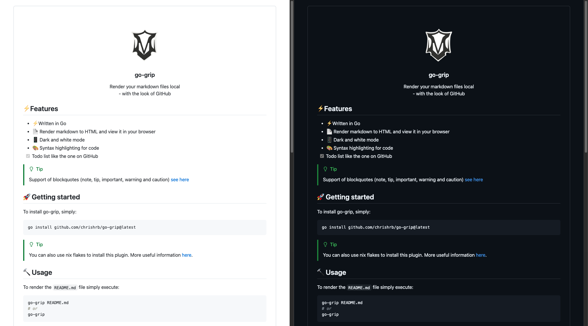

<!-- PROJECT LOGO -->
<br />
<div align="center">
  <a href="#">
    
  </a>

  <h3 align="center">go-grip</h3>

  <p align="center">
    Render your markdown files local<br>- with the look of GitHub
  </p>
</div>

## Table of Contents

- [About](#question-about)
- [Features](#zap-features)
- [Getting started](#rocket-getting-started)
- [Usage](#hammer-usage)
- [Examples](#pencil-examples)
- [Known TODOs / Bugs](#bug-known-todos--bugs)
- [Similar tools](#pushpin-similar-tools)

## :question: About

**go-grip** is a lightweight, Go-based tool designed to render Markdown files locally, replicating GitHub's style. It offers features like syntax highlighting, dark mode, and support for mermaid diagrams, providing a seamless and visually consistent way to preview Markdown files in your browser.

This project is a reimplementation of the original Python-based [grip](https://github.com/joeyespo/grip), which uses GitHub's web API for rendering. By eliminating the reliance on external APIs, go-grip delivers similar functionality while being fully self-contained, faster, and more secure - perfect for offline use or privacy-conscious users.

## :zap: Features

- :zap: Written in Go :+1:
- 📄 Render markdown to HTML and view it in your browser
- 📱 Dark and light theme
- 🎨 Syntax highlighting for code
- [x] Todo list like the one on GitHub
- Support for github markdown emojis :+1:
- Support for mermaid diagrams
- hashtag linking in page (see table of contents)


```mermaid
graph TD;
    A-->B;
    A-->C;
    B-->D;
    C-->D;
```

```go
package main

import "github.com/chrishrb/go-grip/cmd"

func main() {
	fmt.Sprintln("Welcome to Grip! Use `go-grip --help` for more information.")
}
```

> [!TIP]
> Support of blockquotes (note, tip, important, warning and caution) [see here](https://github.com/orgs/community/discussions/16925)

> [!IMPORTANT]
>
> test

## :rocket: Getting started

To install go-grip, simply:

```bash
go install github.com/chrishrb/go-grip@latest
```

> [!TIP]
> You can also use nix flakes to install this plugin.
> More useful information [here](https://nixos.wiki/wiki/Flakes).

## :hammer: Usage

To render the `README.md` file simply execute:

```bash
go-grip README.md
# or
go-grip
```

The browser will automatically open on http://localhost:6419. You can disable this behaviour with the `-b=false` option.

You can also specify a port:

```bash
go-grip -p 80 README.md
```

or just open a file-tree with all available files in the current directory:

```bash
go-grip -r=false
```

It's also possible to activate the darkmode:

```bash
go-grip -d .
```

To disable automatic browser reload on file changes (useful for stable editing):

```bash
go-grip --no-reload README.md
```

To terminate the current server simply press `CTRL-C`.

## :pencil: Examples



## :bug: Known TODOs / Bugs

- [ ] Maybe use githubs original mermaid renderer with zoom option etc. (https://viewscreen.githubusercontent.com/markdown/mermaid?docs_host=https%3A%2F%2Fdocs.github.com&color_mode=dark#a5f40142-95a0-45db-8a9a-e1fb39a6488b)
- [ ] Make it possible to export the generated html

## :pushpin: Similar tools

This tool is a Go-based reimplementation of the original [grip](https://github.com/joeyespo/grip), offering the same functionality without relying on GitHub's web API.
